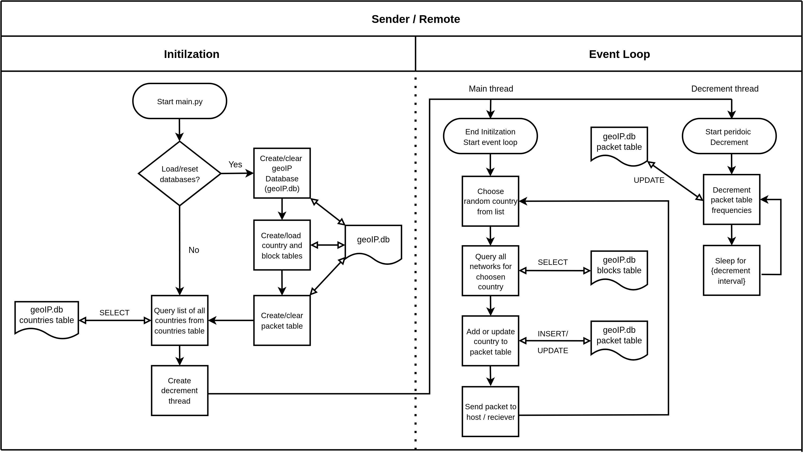
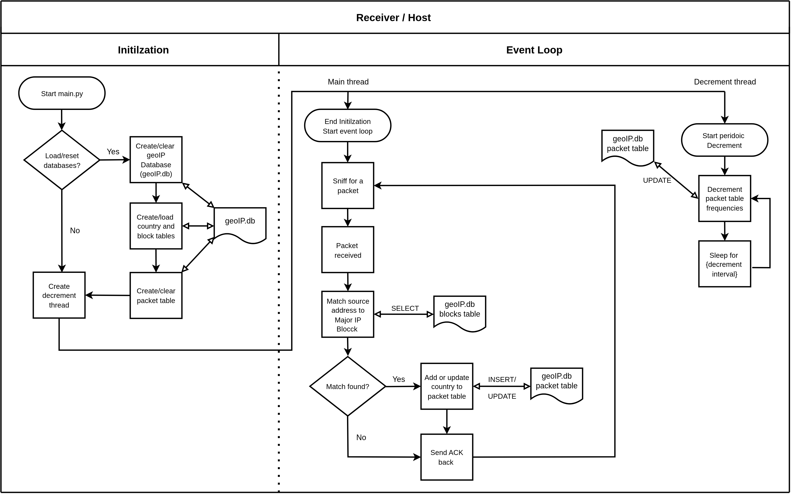
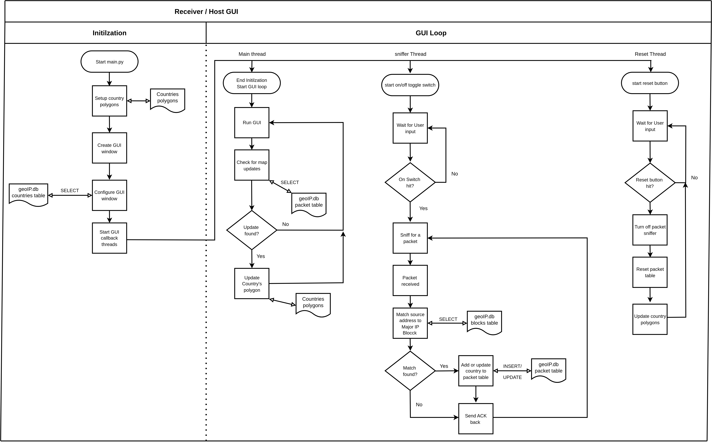

# README file for the Geo IP map project


## Releases 

### Release 2.0 Map GUI 

- A bash script is used to build and start two docker containers: 
1. remote: The container sending packets 
2. host: The container receiving packets

- A GUI is now implemented for showing packet frequencies from major countries

- A selected amount of countries were sent from the sender to test the gradient more easily

#### Sender / Remote
- sender (remote container) can read from the SQL lite database (geoIP.db) of random countries and their Major IP blocks, append the CIDR mask as a payload, and sent to the receiver (host container). 
- sender will also append all packets they try to send to the reciever to a new packet table. This table keeps track of two things: the geoname_id and # of packets sent over. The # of packets (column Frequency in packet table) is also decremented by another thread every `FREQ_MIN` seconds found in my `config.py` file. 

**Code Flow Diagram**



#### Receiver / Host
- receiver (host container) can read the IP packet, decode the payload, and **match** the payloads passed IP address + cidr mask to a country from its own database (geoIP).
- receiver also appends all packets recieved to a new table called packet table. This table keeps track of the of two things: the geoname_id and the # of packets recieved. The # of packets (column frequency in the packet table) is also decremnted by anotehr thread every `FREQ_MIN` seconds defined in my `config.py` file. 

- Both devices can send and recognize IP packets "sent" from the same country. 

- Both now use a single database with two tables in it.

- The receiver / host app now also has a seperate GUI that can be started to count packet frequencies for a country. Packet decrement intervals can also be setup to lower the countries gradient counts as time goes on.

##### Code Flow Diagram for sniff packet sniffer



##### Code Flow Diagram for GUI 

##### Code Flow Diagram for sniff packet sniffer



***NOTE***: `config.py` is not published because it holds information I cannot publish online.

### Release 1.2 Sliding-window 

- A bash script is used to build and start two docker containers: 
1. remote: The container sending packets 
2. host: The container receiving packets


#### Sender / Remote
- sender (remote container) can read from the SQL lite database (geoIP.db) of random countries and their Major IP blocks, append the CIDR mask as a payload, and sent to the receiver (host container). 
- sender will also append all packets they try to send to the reciever to a new packet table. This table keeps track of two things: the geoname_id and # of packets sent over. The # of packets (column Frequency in packet table) is also decremented by another thread every `FREQ_MIN` seconds found in my `config.py` file. 

**Code Flow Diagram**


#### Receiver / Host
- receiver (host container) can read the IP packet, decode the payload, and **match** the payloads passed IP address + cidr mask to a country from its own database (geoIP).
- receiver also appends all packets recieved to a new table called packet table. This table keeps track of the of two things: the geoname_id and the # of packets recieved. The # of packets (column frequency in the packet table) is also decremnted by anotehr thread every `FREQ_MIN` seconds defined in my `config.py` file. 

- Both devices can send and recognize IP packets "sent" from the same country. 

- Both now use a single database with two tables in it.

**Code Flow Diagram**


***NOTE***: `config.py` is not published because it holds information I cannot publish online.

### Release 1.1 Matching 

- A bash script is used to build and start two docker containers: 
1. remote: The container sending packets 
2. host: The container receiving packets

- sender (remote container) can read from the SQL lite databases of random countries and their Major IP blocks, append the CIDR mask as a payload, and sent to the receiver (host container).  

- receiver (host container) can read the IP packet, decode the payload, and **match** the payloads passed IP address + cidr mask to a country from its own databases.

- Both devices can send and recognize IP packets "sent" from the same country

***NOTE***: `config.py` is not published because it holds information I cannot publish online.


### Release 1.0 Basic
- A bash script is used to build and start two docker containers: 
1. remote: The container sending packets 
2. host: The container receiving packets

- sender (remote container) can read from the SQL lite databases of random countries and their Major IP blocks, append the CIDR mask as a payload, and sent to the receiver (host container).  

- receiver (host container) can read the IP packet, decode the payload, and print the network address + CIDR mask in the payload. 

***NOTE***: `config.py` is not published because it holds information I cannot publish online.


## Common docker commands
- Run these in the same directory as `docker.sh`

- Build the containers image
```
./docker.sh build
```

- Open the two containers terminals 
```
./docker.sh start
```

- To close and stop both containers
```
docker kill host remote
```

- To check the containers name if the above does not work run: 
```
docker ps
```
- then keep what ever `NAMES` have `scapy_base` under `IMAGE`

- Stop the docker network
```
docker network rm scapy_net
```

- If you break network access again run this: 
```
docker build --network=host -t scapy_base -f proj/Dockerfile.scapy proj
```

- Remove all old docker build aritfacts 
```
docker system prune
```